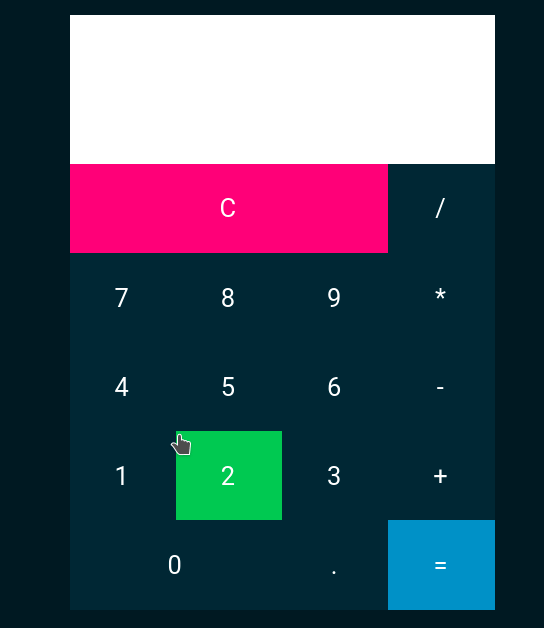

<h1 align=center>🧮 Javascript Calculator </h1>
<p align=center>
A simple calculator for desktop made with javascript css html and electron.<br />
This project made for learning.<br />
The layout was based on <a href="https://www.youtube.com/watch?v=BuZtAqk5LIY">this video</a></p>
<h2 align=center>

</h2>
<h1 align=center>Build</h1>
<p align=center>To build run this command:</p>

```shell
yarn build
```